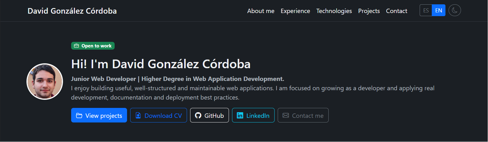

# Portfolio - David González Córdoba

## 🌐 Web publicada

🔗 [Ver portfolio publicado](https://davidgoncor3005.github.io/)



## 🛠️ Tecnologías

- **Astro**
- **TypeScript**
- **SCSS**
- **Bootstrap 5**
- **Bootstrap Icons**
- **JavaScript**
- **GitHub Pages**
- **GitHub Actions**

## 📂 Estructura

```txt
davidgoncor3005.github.io/
├── .github/
│   └── workflows/
│       └── deploy.yml
├── astro-v2/
│   ├── public/
│   │   ├── docs/
│   │   └── images/
│   ├── src/
│   │   ├── components/
│   │   │   ├── About.astro
│   │   │   ├── Contact.astro
│   │   │   ├── Experience.astro
│   │   │   ├── Footer.astro
│   │   │   ├── Hero.astro
│   │   │   ├── Navbar.astro
│   │   │   ├── PortfolioPage.astro
│   │   │   ├── Projects.astro
│   │   │   └── Technologies.astro
│   │   ├── data/
│   │   │   ├── projects.json
│   │   │   └── technologies.json
│   │   ├── i18n/
│   │   │   ├── en.ts
│   │   │   ├── es.ts
│   │   │   └── index.ts
│   │   ├── layouts/
│   │   │   └── BaseLayout.astro
│   │   ├── pages/
│   │   │   ├── en/
│   │   │   │   └── index.astro
│   │   │   └── index.astro
│   │   ├── styles/
│   │   │   └── main.scss
│   │   └── types/
│   │       └── portfolio.ts
│   ├── astro.config.mjs
│   ├── package.json
│   └── tsconfig.json
└── README.md
```

## Comandos

Los comandos se ejecutan dentro de la carpeta `astro-v2`:

```bash
cd astro-v2
npm install
npm run dev
npm run build
npm run preview
```

## Características principales

- Portfolio desarrollado con **Astro**.
- Diseño responsive con **Bootstrap 5**.
- Estilos organizados con **SCSS**.
- Contenido separado en componentes.
- Proyectos y tecnologías cargados desde archivos JSON.
- Versión en español e inglés:
  - `/`
  - `/en/`
- Modo claro / oscuro con `localStorage`.
- SEO.
- Accesibilidad.
- Despliegue preparado con **GitHub Actions**.
