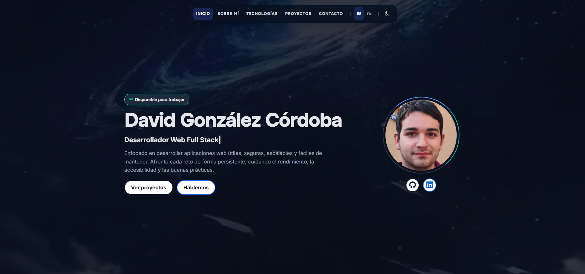

# Portfolio - David González Córdoba

## 🌐 Web publicada

🔗 [Ver portfolio publicado](https://davidgonzalezcordoba-dev.vercel.app/)



## 🛠️ Tecnologías

- **Astro**
- **TypeScript**
- **SCSS**
- **JavaScript**
- **Simple Icons**
- **Bootstrap Icons**
- **GitHub Pages**
- **GitHub Actions**

## 📂 Estructura

```txt
davidgoncor3005.github.io/
├── .github/
│   └── workflows/
│       └── deploy.yml
├── public/
│   ├── docs/
│   ├── images/
│   └── media/
├── src/
│   ├── components/
│   ├── config/
│   ├── data/
│   ├── features/
│   ├── i18n/
│   ├── layouts/
│   ├── pages/
│   ├── scripts/
│   ├── styles/
│   ├── types/
│   └── utils/
├── astro.config.mjs
├── package.json
├── package-lock.json
├── tsconfig.json
└── README.md
```

## Comandos

Los comandos se ejecutan desde la raíz del repositorio:

```bash
npm install
npm run dev
npm run build
npm run preview
```

## Características principales

- Portfolio desarrollado con **Astro**.
- Diseño responsive.
- Estilos organizados con **SCSS**.
- Contenido separado en componentes.
- Proyectos y tecnologías cargados desde archivos JSON.
- Versión en español e inglés:
  - `/`
  - `/en/`
- Modo claro / oscuro con `localStorage`.
- SEO.
- Accesibilidad.
- Despliegue preparado con **GitHub Actions**.
